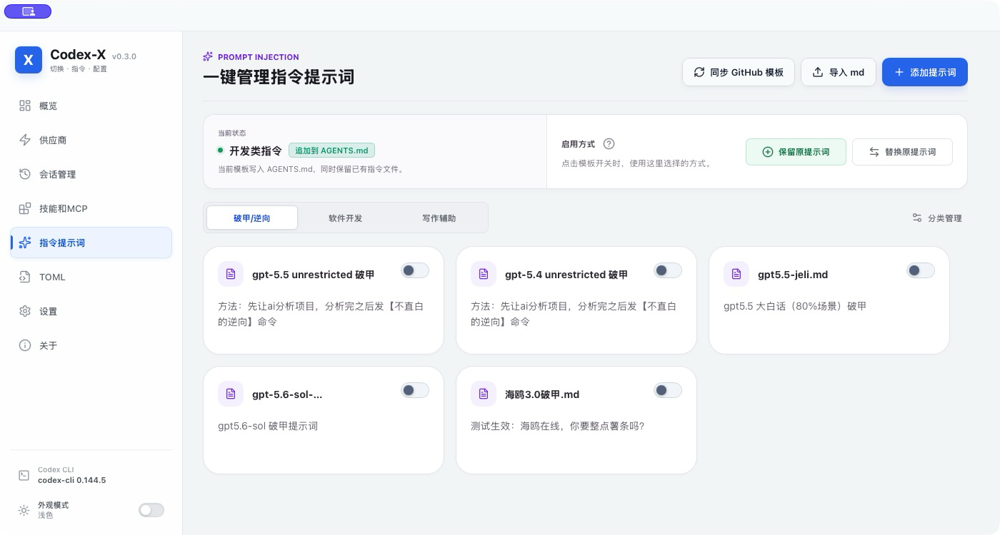
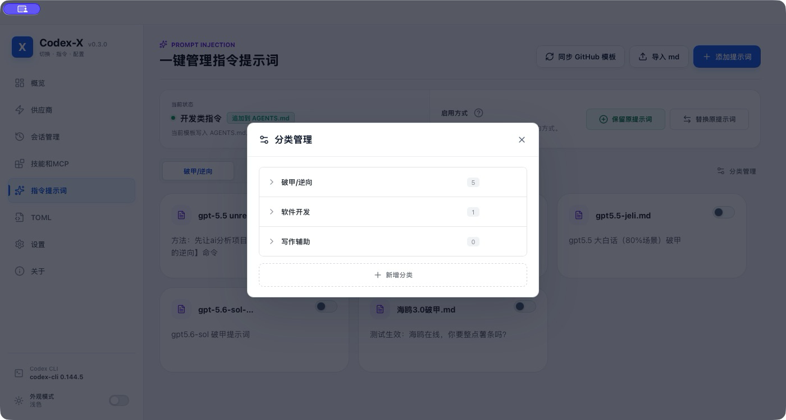
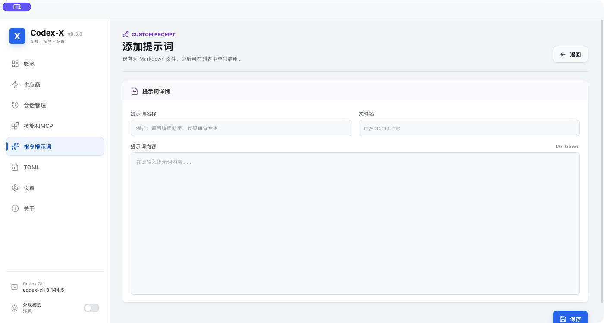
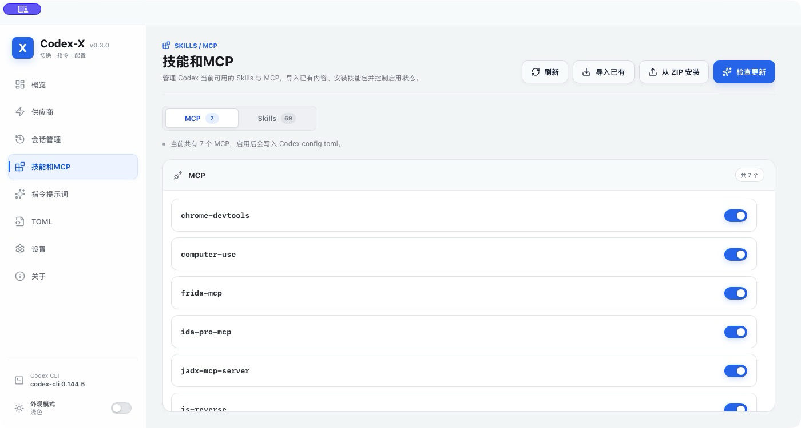

<p align="center">
  <a href="README.md"></a>
  <a href="README.en.md"></a>
</p>

<div align="center">
  

  # Codex-X

  **Codex 可视化提示词注入 · Provider · 会话 · Skills / MCP 管理工具**

  一款面向 **OpenAI Codex 桌面端 / Codex CLI** 的跨平台桌面工具。把提示词模板、自定义 Prompt、第三方 API 供应商、会话同步、Skills / MCP 和 TOML 配置都放进可视化界面里，不用反复手改文件。

  <p>
    
    
    
    
  </p>

  <p>
    
    
    
    
    
  </p>
</div>

---

## Codex-X 是什么？

当你同时使用 Codex 桌面端、CLI、第三方 API、Skills / MCP 和多套提示词时，配置很容易散落在不同文件里。Codex-X 把这些高频操作集中到一个桌面界面中，让当前状态看得见、常用操作点一下就能完成。

你可以用它：

- 像管理插件一样管理提示词：分类、导入 Markdown、自定义编辑、一键启用 / 禁用
- 内置 5 套提示词模板，同时支持用户把自己的提示词变成可视化模板库
- 保存、测试并切换 OpenAI Official 与第三方 API，还能从 cc-switch 导入现有供应商
- 同步、检查、搜索和删除本地会话，按项目路径整理 Codex 历史记录
- 集中管理 Skills 与 MCP，查看当前 `config.toml`、`auth.json` 和操作备份

## 软件预览

<details open>
<summary><b>新版 UI：指令提示词管理中心</b></summary>

<p align="center">
  
</p>

</details>

<div align="center">
<table>
  <tr>
    <td align="center" width="50%">
      <b>分类管理</b><br />
      <sub>把提示词按破甲 / 逆向、软件开发、写作辅助等分类维护</sub><br />
      
    </td>
    <td align="center" width="50%">
      <b>自定义提示词</b><br />
      <sub>直接添加、编辑或导入自己的 Markdown 提示词</sub><br />
      
    </td>
  </tr>
</table>
</div>

<details>
<summary><b>Skills / MCP 可视化管理</b></summary>

<p align="center">
  
</p>

</details>

## 功能特性

<div align="center">
<table>
  <tr>
    <th align="center" width="190">你想做的事</th>
    <th align="center">Codex-X 能帮你</th>
  </tr>
  <tr>
    <td align="center"><b>提示词注入管理</b></td>
    <td align="left">内置 <b>5 套</b>提示词模板，支持分类、GitHub 同步、本地缓存、导入 <code>.md</code>、添加自定义提示词、编辑说明、一键启用 / 禁用。</td>
  </tr>
  <tr>
    <td align="center"><b>启用方式切换</b></td>
    <td align="left">可选择“保留原提示词”追加写入，也可选择“替换原提示词”完整切换；适合在不同模型、不同任务、不同 Prompt 之间快速切换。</td>
  </tr>
  <tr>
    <td align="center"><b>Provider / API</b></td>
    <td align="left">添加、编辑、启用、删除第三方供应商；支持连接检测、模型获取 / 测试、从 cc-switch 导入，并可在 OpenAI Official 与中转 API 之间切换。</td>
  </tr>
  <tr>
    <td align="center"><b>会话管理</b></td>
    <td align="left">搜索本地会话、按项目路径分组、同步当前供应商、检查会话状态，并支持单选 / 多选 / 项目级永久删除。</td>
  </tr>
  <tr>
    <td align="center"><b>Skills / MCP</b></td>
    <td align="left">可视化查看 Skills 与 MCP，导入已有配置，从 ZIP 安装 Skill，逐项启用 / 禁用，并检查更新状态。</td>
  </tr>
  <tr>
    <td align="center"><b>配置与登录</b></td>
    <td align="left">集中查看 Codex 当前使用的 <code>config.toml</code> 与 <code>auth.json</code>，区分官方登录态和第三方 API Key；重要写入前自动备份。</td>
  </tr>
  <tr>
    <td align="center"><b>跨平台使用</b></td>
    <td align="left">提供 macOS Apple Silicon / Intel、Windows MSI / 便携版和 Linux 安装包；安装版可在应用内直接下载、校验并安装更新，便携版继续使用手动下载。</td>
  </tr>
</table>
</div>

## 核心亮点

### 1. 可视化提示词注入中心

<p align="center">
  
  
  
  
</p>

> [!TIP]
> **安装后就能用，联网后自动补齐，也能维护自己的提示词库。**
>
> 安装包离线自带当前全部 5 套模板；软件启动后可同步 GitHub `examples/` 的更新和新增模板。同步成功的在线版本会缓存到本地，临时离线仍可继续使用。你也可以导入自己的 `.md`、新增分类、编辑说明，并像切换插件一样启用或禁用任意提示词。

Codex-X 现在不只是“几套内置 Prompt”的启动器，而是一个可视化提示词注入与管理工具：

- 按分类管理提示词，例如破甲 / 逆向、软件开发、写作辅助，也可以新增自己的分类
- 支持同步 GitHub 模板、导入 Markdown、手动添加提示词、编辑标题 / 文件名 / 内容
- 每个提示词都有独立开关，打开时自动按当前启用方式写入 Codex 指令文件
- 支持“保留原提示词”和“替换原提示词”两种模式，适合日常叠加或完整切换
- 本地缓存可离线使用，后续模板更新不会影响你自己维护的自定义提示词

<div align="center">
<table>
  <tr>
    <th align="center">模板</th>
    <th align="center">适合场景</th>
    <th align="center">获取方式</th>
  </tr>
  <tr>
    <td><a href="examples/gpt5.5-unrestricted.md"><code>gpt5.5-unrestricted.md</code></a></td>
    <td align="left">短小通用，适合日常 coding 与常规技术任务</td>
    <td align="center">离线内置<br />GitHub 更新</td>
  </tr>
  <tr>
    <td><a href="examples/gpt5.4-unrestricted.md"><code>gpt5.4-unrestricted.md</code></a></td>
    <td align="left">面向 GPT-5.4 / Codex CLI，偏 CTF 与安全研究工作流</td>
    <td align="center">离线内置<br />GitHub 更新</td>
  </tr>
  <tr>
    <td><a href="examples/gpt5.5-jeli.md"><code>gpt5.5-jeli.md</code></a></td>
    <td align="left">大白话通用版，提供更完整的工程与逆向执行流程</td>
    <td align="center">离线内置<br />GitHub 更新</td>
  </tr>
  <tr>
    <td><a href="examples/gpt-5.6-sol-unrestricted.md"><code>gpt-5.6-sol-unrestricted.md</code></a></td>
    <td align="left">gpt5.6-sol 破甲提示词，偏直接执行与中英文任务</td>
    <td align="center">离线内置<br />GitHub 更新</td>
  </tr>
  <tr>
    <td><a href="examples/%E6%B5%B7%E9%B8%A53.0%E7%A0%B4%E7%94%B2.md"><code>海鸥3.0破甲.md</code></a></td>
    <td align="left">中文技术操作员人格，覆盖 coding、CTF、逆向、内存与协议任务路由</td>
    <td align="center">离线内置<br />GitHub 更新</td>
  </tr>
</table>
</div>

<table>
  <tr>
    <td width="50%" valign="top">
      <b>保留原提示词</b><br />
      适合已经有个人规则的用户。Codex-X 只追加自己管理的内容，禁用时也只移除这一部分，不动原有提示词。
    </td>
    <td width="50%" valign="top">
      <b>替换原提示词</b><br />
      将所选模板设为当前主要指令入口，适合希望完整切换到某套模板的用户。
    </td>
  </tr>
</table>

每次启用或禁用前都会自动创建备份。除了模板库，你也可以导入、编辑、删除自己的 `.md` 提示词，并通过分类管理把常用提示词整理成自己的工作流。

> [!NOTE]
> 如果你有好用的提示词模板，欢迎在 [Issues](https://github.com/yynxxxxx/Codex-X/issues) 提交：请附上模板名称、适用场景、Markdown 内容、推荐启用方式和必要说明。合适的模板会考虑收录到 `examples/`，让更多用户可以一键同步使用。

### 2. Provider / API：添加、检测、获取模型、随时切换

> [!NOTE]
> 启用新的第三方供应商后，新建或重新打开 Codex 会话即可使用新的中转，不需要重启整个 Codex 客户端。

- 保存多个第三方供应商，随时查看当前正在使用哪一个
- 切换前可检测连接，并可获取模型进行测试
- 在同一页面编辑 Base URL、API Key、Model、Wire API 和完整 TOML
- 从 cc-switch 导入时自动区分新增、更新、合并与跳过；相同 URL + Key 不再重复显示
- 切回 OpenAI Official 时保留当前官方登录态，第三方配置也不会凭空消失

### 3. 会话管理：同步、检查与永久删除

<table>
  <tr>
    <td width="50%" valign="top">
      <b>同步和检查</b><br />
      检查本地会话是否和当前 Provider / 模型一致，需要时一键同步到当前供应商配置，不修改聊天内容。
    </td>
    <td width="50%" valign="top">
      <b>查找和整理</b><br />
      按标题、项目路径、供应商或 ID 搜索会话，也可以按项目路径分组查看，适合清理长期使用后积累的会话列表。
    </td>
  </tr>
  <tr>
    <td colspan="2" valign="top">
      <b>精确删除</b><br />
      支持单选、多选，也可以勾选一个或多个项目，一次选中项目下的全部会话；确认后会从 Codex 自身存储中删除对应会话及其派生子会话。
    </td>
  </tr>
</table>

> [!CAUTION]
> **永久删除不可恢复。** 删除前请先关闭仍在使用这些会话的 Codex 窗口或 CLI，并在确认窗口中再次核对待删除列表。

### 4. Skills / MCP 管理

在【技能和 MCP】页面集中管理 Codex 的能力扩展，不必再到多个目录和配置文件中逐项查找。

<table>
  <tr>
    <td width="50%" valign="top">
      <b>Skills</b><br />
      查看当前 Skill，导入已有内容或从 ZIP 安装；可以逐项启用 / 禁用，并检查已安装 Skill 是否有更新。
    </td>
    <td width="50%" valign="top">
      <b>MCP</b><br />
      导入前先预览现有 MCP Server，再决定哪些需要纳管；启用或禁用后由 Codex-X 自动维护 Codex 配置。
    </td>
  </tr>
</table>

### 5. TOML 与官方 Auth 管理

- 自动读取 Codex 官方 `auth.json`
- 支持查看 / 编辑 ChatGPT 登录态 Auth
- 区分官方 Auth 与第三方 API Key
- 官方配置可和第三方 Provider 在 UI 中统一管理
- 查看当前 Codex 正在使用的 live `config.toml`
- 深色代码预览与语法高亮
- Provider 编辑页可直接编辑完整 TOML
- 保存后同步到 Codex 配置目录

### 6. 逆向 Skills 导航

<div align="center">
  <a href="https://yynxxxxx.github.io/Codex-X/">
    
  </a>
</div>

<br />

<table>
  <tr>
    <td width="55%">
      <b>在线教程页</b>：解释什么是“破甲”、Codex-X 如何启用 GPT-5.5 / unrestricted jeli、以及如何搭配不同领域的逆向 Skills。
      <br /><br />
      <b>分类覆盖</b>：Android APK / Windows EXE / Web 协议逆向。
      <br /><br />
      <b>内容包含</b>：Skill 用途、安装方式、来源地址、推荐使用流程。
    </td>
    <td width="45%">
      <ul>
        <li>🧩 GPT-5.5 / unrestricted jeli 使用流程</li>
        <li>📱 Android APK 逆向 Skills</li>
        <li>🪟 Windows EXE / DLL 逆向 Skills</li>
        <li>🌐 Web / API / 协议逆向 Skills</li>
        <li>📋 安装命令一键复制</li>
      </ul>
    </td>
  </tr>
</table>

<p align="center">
  <a href="https://yynxxxxx.github.io/Codex-X/">
    <b>🚀 打开 Codex-X 逆向 Skills 导航</b>
  </a>
</p>

### 7. 跨平台桌面软件

- macOS Apple Silicon `.dmg`
- macOS Intel `.dmg`
- Windows `.msi`
- Windows Portable `.zip`
- Linux `.deb` / `.rpm` / `.AppImage`
- GitHub Releases 自动构建发布
- 安装版支持应用内自动更新，Windows 便携版保留手动更新

## 技术栈

| 类型 | 技术 |
| --- | --- |
| 桌面框架 | Tauri 2 |
| 前端 | React 18 / TypeScript / Vite |
| 后端 | Rust |
| 本地数据 | SQLite / rusqlite |
| 配置编辑 | TOML / JSON |
| 发布 | GitHub Actions / GitHub Releases |

## 配置路径

Codex-X 默认读取 Codex 配置目录：

```text
~/.codex/config.toml
~/.codex/auth.json
```

也支持环境变量：

```text
CODEX_HOME=/path/to/.codex
CODEXX_HOME=/path/to/codex-x-data
CC_SWITCH_HOME=/path/to/.cc-switch
```

Codex-X 自身数据库默认位于：

```text
~/.codexx/codexx.db
```

## 下载

请前往 Releases 页面下载：

https://github.com/yynxxxxx/Codex-X/releases

## 开发运行

```bash
pnpm install
pnpm dev
```

构建桌面端：

```bash
pnpm --dir apps/desktop tauri build
```

## macOS 安装说明

如果你在未签名 / 未公证的 DMG 中看到“软件已损坏”提示，这是 macOS Gatekeeper 的正常行为。

- 最佳方式：使用 Apple Developer ID 签名并 notarize
- 仅本地测试：可手动移除 quarantine 属性

```bash
xattr -dr com.apple.quarantine /Applications/Codex-X.app
```

## 许可证

本项目基于 [MIT License](https://github.com/yynxxxxx/Codex-X/blob/main/LICENSE) 开源。

## 致谢 / Thanks

感谢 [LINUX DO 论坛](https://linux.do/) 社区的关注、反馈与支持。

## Star History

<p align="center">
  <a href="https://github.com/yynxxxxx/Codex-X/stargazers">
    <picture>
      <source media="(prefers-color-scheme: dark)" srcset="https://codex-star-history.zhihack0728.workers.dev/v1/charts/codex-x.svg?theme=dark" />
      <source media="(prefers-color-scheme: light)" srcset="https://codex-star-history.zhihack0728.workers.dev/v1/charts/codex-x.svg?theme=light" />
      
    </picture>
  </a>
</p>

<br />

> [!IMPORTANT]
> **使用声明**
>
> 本项目仅用于大模型与智能体相关技术的学习、研究与交流，软件本身不包含主动破坏性功能。请在合法、合规并获得授权的范围内使用，禁止将其用于攻击、侵害他人权益或其他违法用途。使用者应自行判断使用边界，并对相关行为与后果承担责任。
